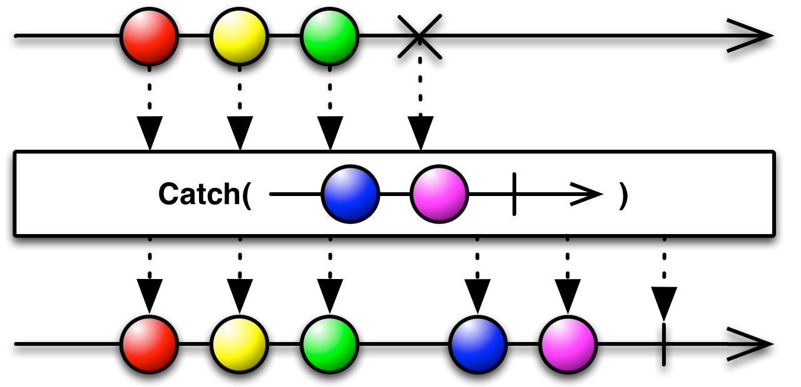

# Rx Error Handling

[**ZURÜCK**](./readme.md) 

Zur Erinnerung:
```
namespace System
{
    public interface IObserver<in T>
    {
        void OnCompleted();
        void OnError( Exception error );
        void OnNext( T value );
    }
}
```

* Built-in Operationen


## Catch

http://reactivex.io/documentation/operators/catch.html



---

## Retry

* 

