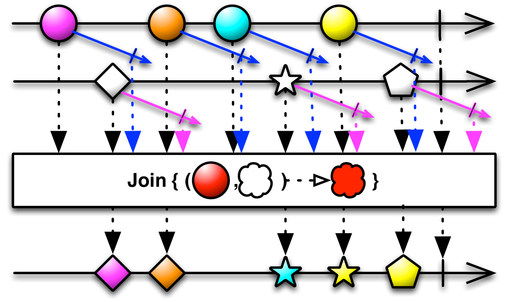

# Rx Operationen

[**ZURÜCK**](./readme.md) 

Auf ```IObservable<T>``` sind zahlreiche Operationen verfügbar.
Diese können direkt über LinQ Extensions oder LinQ ausgedrückt werden.

## Operatoren
http://reactivex.io/documentation/operators.html

Kategorien:
* Creating Observables
* Transforming Observables
* Filtering Observables
* Combining Observables: mehrere Source Observables werden kombiniert ("higher order functions")

Einige Operatoren haben **zeitbasierte** Semantik!

## Wie liest man das Marble Diagramm?


## Beispiele

---
### Filter


---

### Max


---

### Map


---

### Buffer


---
### Join



---
### Zip


* kein Equality basiertes Joining, sondern basierend auf zeitlicher Überlappung


### Create Observable Operation
Events werden in eine Observable umgewandelt:

```
_fileCreatedObseringDisposable = Observable.FromEventPattern<FileEventArgs>(
                    ev => _inputFilewatcher.FileCreatedNew += ev,
                    ev => _inputFilewatcher.FileCreatedNew -= ev )
                .Select( ev => ev.EventArgs.Path )
                .Buffer( TimeSpan.FromMilliseconds( 500 ), 6 )
                .Subscribe( ( files ) => ...);
```
