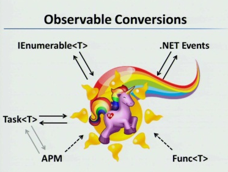

# Rx Introduction

[**ZURÜCK**](./readme.md) 

Rx ist eine Bibliothek für asynchrones und event basiertes programmieren.

Mit Rx kann man
1. (asynchrone) data streams repräsentieren (**Observables**)
2. auf diesen data streams verschiedene Operationen durchgeführen (**LinQ**)
3. Nebenläufigkeit (concurrency) parametrisieren (**Scheduling**)

* Rx = Observables + LinQ + Scheduler

* Observables sind das unifying interface




* Semantisch bieten Observables zusätzlich:
1. der Producer der Events kann dem Consumer vermitteln, wann keine Daten mehr kommen (OnCompleted)
2. der Producer der Events kann dem Consumer vermitteln, dass ein Fehler passiert ist (OnError)


* Bestehende Asynchronität oder Event Handling wird nicht ersetzt! (async await / TPL, .NET event)


* Unterschied IEnumerable<T> vs IObservable<T>
  IEnumerable : "pull" aus einer Sequenz von T
  IObservable : eine Sequenz von T

## IEnumerable vs IObservable

```IEnumerable<T> Observable.ToEnumerable(this IObservable<T>)```
* Wenn ein T vom Observable "gepushed" wird, landet es in einer queue, bis man es "pullt" (z.B. "To.List()")
* Wenn man auf einer leeren Sequenz "pullt", wird blockiert, bis diese queue nicht mehr leer ist und dann dequeued.

```IObservable<T> Observable.ToObservable(this IEnumerable<T>)```
* Ein Thread aus dem .NET thread pool wird periodisch versuchen die IEnumerable zu pullen
* Jedes Mal wenn er ein T "pullt, wird das über das IObservable bis zum Subscriber "gepusht"

### Wann soll was verwendet werden?

* A huge CSV text file has an item on each line, and you want to process them one at a time without loading the entire file into memory at once

* You are running an HTTP web server

* You are responding to user interface button clicks


